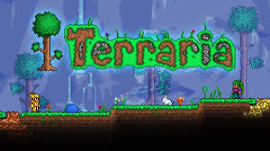
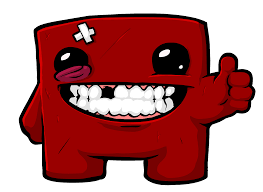
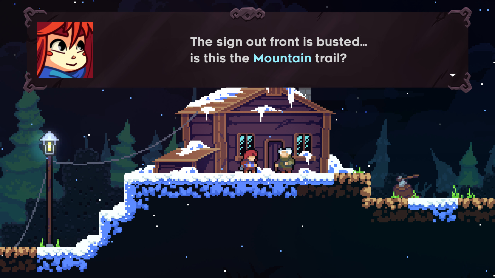
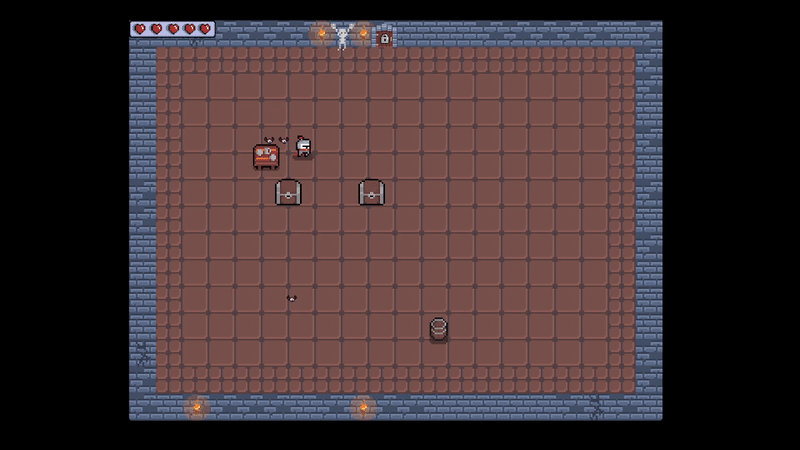

# ELPEPE -  
A Little Self-Taught C++ Project

This is a small, somewhat self-taught project I made during my early days of learning C++ programming.  
It’s full of hardcoded stuff, endless and not-so-optimized code streams, and probably quite a few bugs —  
but it was a lot of fun to create!

I used the famous SDL library, well known in the game development world.  
Some notable games made with SDL include:

**Terraria**  
  

**Super Meat Boy**  
  

**Celeste**  
  

This is just a small demo. I tried to make it runnable on both Windows and Ubuntu.

On **Windows**, run the script `setup_and_run` with administrator privileges.

On **Ubuntu**, simply run `make && ./ELPEPE` from the project root.

---

### Controls:  
- **WASD** to move around  
 
- **Spacebar** to attack  
- **Q** for heavy attack  
- **E** to interact  
- **Esc** to exit  

Enjoy!

---

**Note:** Back when I first developed this project, artificial intelligence wasn’t part of the picture yet.
