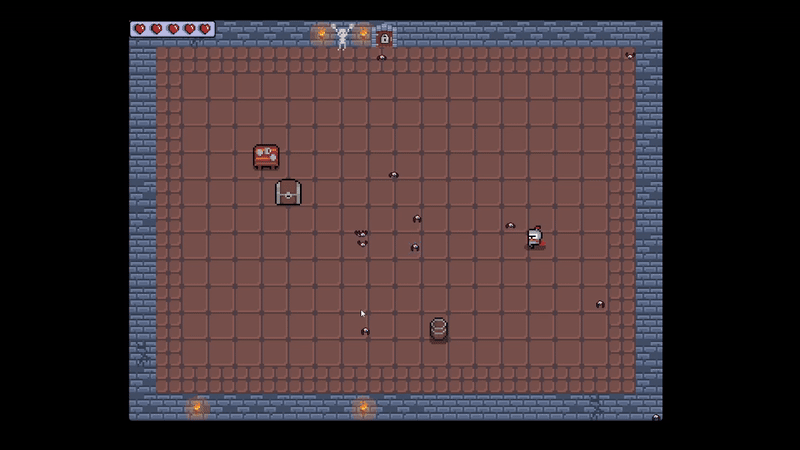
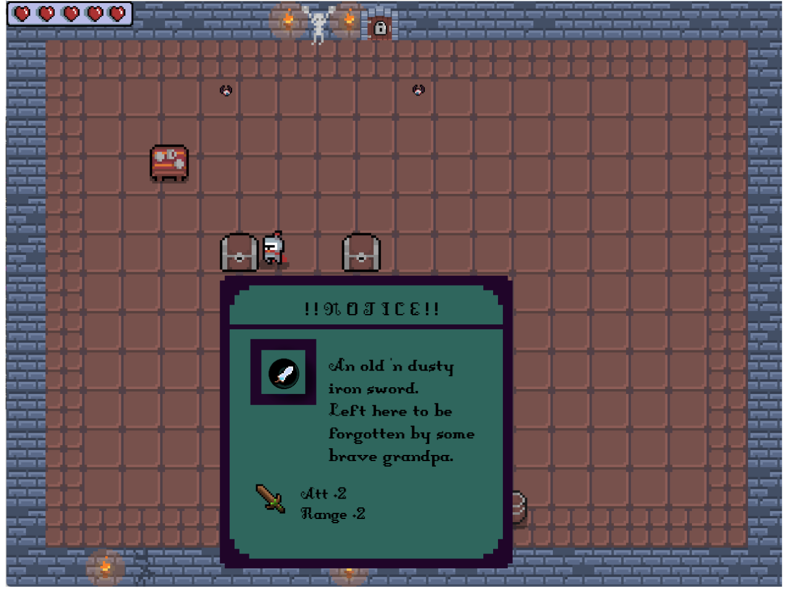
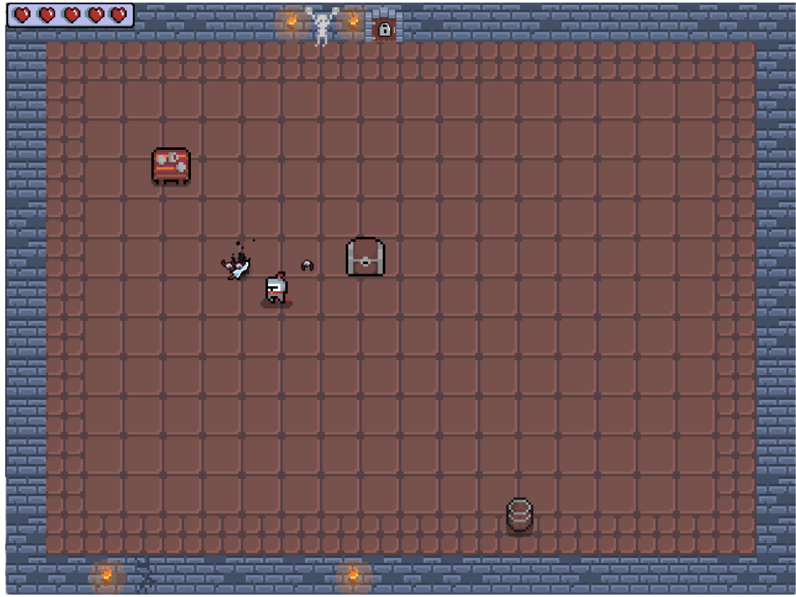
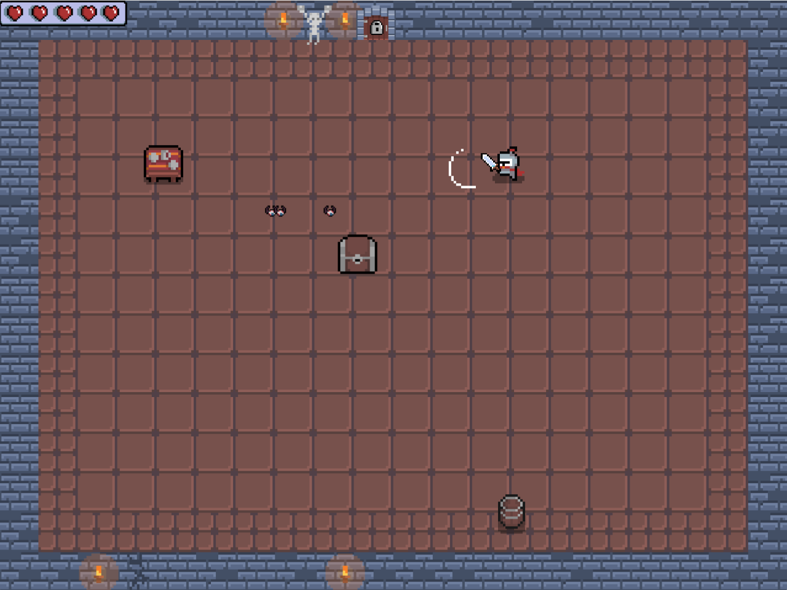

# ELPEPE
*A C++ Learning Adventure with SDL*

## Overview
ELPEPE is a 2D action game (demo) developed as a personal learning project during my journey into C++ programming. Built with the SDL library, this project represents my early exploration of game development concepts and C++ fundamentals.

**Note**: This project was developed using C++98 standards and reflects my learning process at the time—expect some rough edges and learning experiments!

## About SDL
This project leverages the Simple DirectMedia Layer (SDL), a powerful cross-platform development library widely used in the game industry. Notable games built with SDL include:

- **Terraria** - The beloved 2D sandbox adventure
- **Super Meat Boy** - The challenging platformer
- **Celeste** - The acclaimed indie platformer


## Installation & Setup

### Windows
Run the `setup_and_run` script with administrator privileges:
```bash
# Right-click on setup_and_run and select "Run as administrator"
```

### Ubuntu/Linux
```bash
make && ./ELPEPE
```

## Controls

| Key | Action |
|-----|--------|
| **W A S D** | Move character |
| **Spacebar** | Basic attack |
| **Q** | Heavy attack |
| **E** | Interact with objects |
| **Esc** | Exit game |

### Gameplay Preview

*Character movement and navigation*


*Heavy attack demonstration*


*Object interaction system*

## Game Assets



## Technical Details
- **Language**: C++ (C++98 standard)
- **Graphics Library**: SDL2
- **Platform Support**: Windows, Ubuntu/Linux
- **Development Focus**: Learning-oriented project with emphasis on understanding core concepts

## Project Status
This is a demo/learning project that showcases:
- Basic 2D rendering with SDL
- Character movement and animation
- Combat system implementation
- Object interaction mechanics
- Cross-platform compatibility

## Acknowledgments
Developed as a self-taught project to explore game development concepts and improve C++ programming skills. While the code may not follow all modern best practices, it represents genuine learning and experimentation with game development fundamentals.

---
